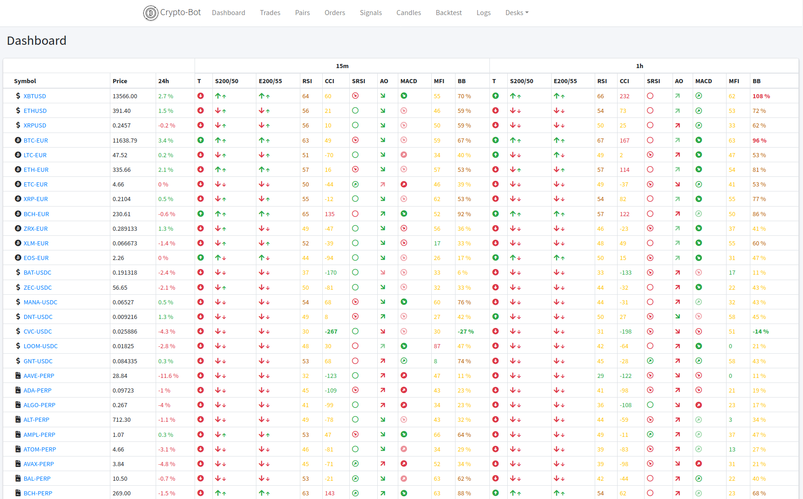
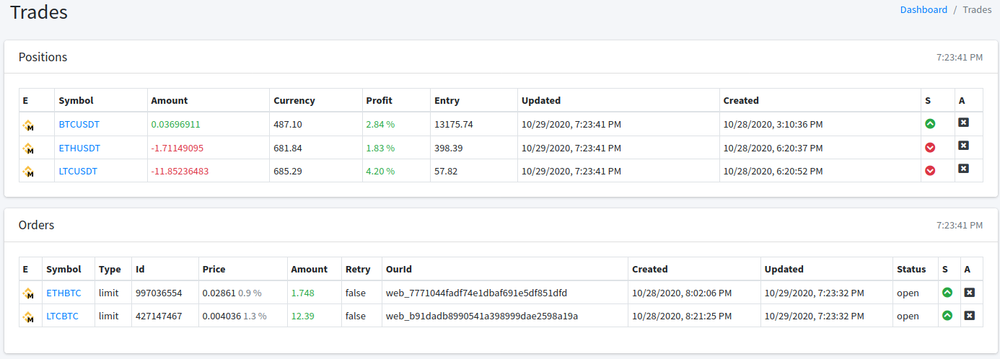
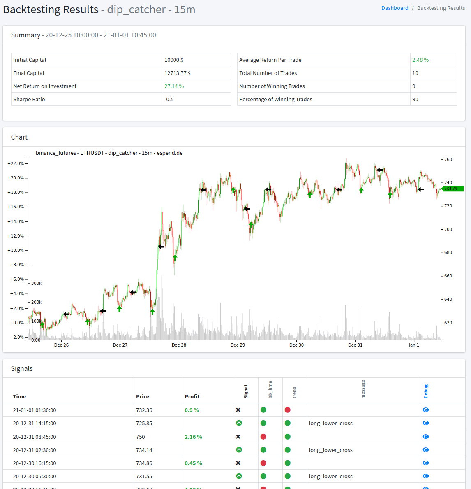
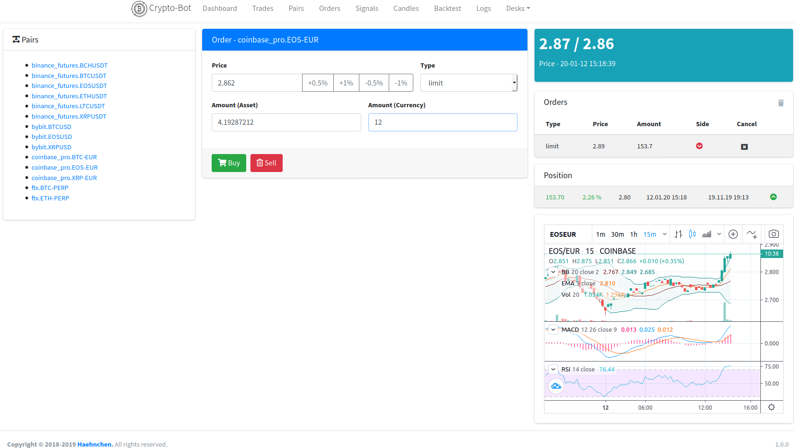

# Crypto Trading Bot

[](https://travis-ci.org/Haehnchen/crypto-trading-bot)

A **work in progress** Cryptocurrency for common exchanges like Bitfinex, Bitmex and Binance.
As most trading bots just provide basic buy and sell signals they provide many stuff to get profitable eg exchange orders like stop-losses or stop-limits are not supported by main bots. Also the limitation of fixed timeframe and technical indicators must be broken  

**Not production ready** only basic functionality

## Features

 * Fully use Websocket for exchange communication to react as fast as possible on market
 * Multi pair support in one instance
 * sqlite3 storage for candles, tickers, ...
 * Webserver UI
 * Support for going "Short" and "Long"
 * Signal browser dashboard for pairs
 * Slack and email notification
 * Join foreign exchange candles (eg. Trade on Bitmex with the faster moving Binance trades / candles)
 * TODO: Show possible arbitrage trades   

### Exchanges

 * [Bitmex](https://www.bitmex.com/register/jS4mLN) with leverage configuration
 * [Bitmex Testnet](https://www.bitmex.com/register/jS4mLN)
 * [Binance](https://www.binance.com/?ref=17569916)
 * [Binance Margin](https://www.binance.com/?ref=17569916)
 * [Binance Futures](https://www.binance.com/?ref=17569916)
 * [Coinbase Pro](https://www.coinbase.com/join/5a2ae60e76531100d3af2ee5)
 * [Bitfinex](https://www.bitfinex.com/?refcode=kDLceRHa) (margin wallet)
 * [Bybit](https://www.bybit.com/app/register?ref=46AK7) with leverage configuration
 * [FTX](https://ftx.com/#a=1494781) (Perpetual Futures only)
 
TODOS:

 * [Huobi Global](https://www.hbg.com/) (margin) 
 
## Technical stuff and packages

 * node.js
 * sqlite3
 * [technicalindicators](https://github.com/anandanand84/technicalindicators)
 * [tulipindicators - tulind](https://tulipindicators.org/list)
 * [TA-Lib](https://mrjbq7.github.io/ta-lib/)
 * twig
 * express
 * Bootstrap v4
 * Tradingview widgets

## How to use


### [optional] Preinstall

The tulip library is used for indicators; which sometimes is having some issues on `npm install` because of code compiling:

Install build tools

```
sudo apt-get install build-essential
```

The nodejs wrapper for tulipindicators is called [Tulip Node (tuind)](https://www.npmjs.com/package/tulind), check out installation instructions there.

Also the build from source is not supporting all nodejs version. It looks like versions <= 10 are working. You can use nodejs 12 if you compiled it once via older version.


### Install packages

```
➜ npm install --production
➜ npm run postinstall
```

Create instance file for pairs and changes

```
cp instance.js.dist instance.js
```

Provide a configuration with your exchange credentials

```
cp conf.json.dist conf.json
```

Create a new sqlite database use bot.sql scheme to create the tables
```
sqlite3 bot.db < bot.sql
```

Lets start it

```
npm start
```

## How to use: Docker

For initialize the configuration once

```
➜ cp instance.js.dist instance.js && cp conf.json.dist conf.json && sqlite3 bot.db < bot.sql
➜ docker-compose build
➜ docker-compose up -d
```
After this you can use `docker-compose` which will give you a running bot via <http://127.0.0.1:8080>

## Setting Up Telegram Bot

First, you'll need to create a bot for Telegram. Just talk to [BotFather](https://telegram.me/botfather) and follow simple steps until it gives you a token for it.
You'll also need to create a Telegram group, the place where you and crypto-trading-bot will communicate. After creating it, add the bot as administrator (make sure to uncheck "All Members Are Admins").

### Retrieving Chat IDs

Invite ```@RawDataBot``` to your group and get your group id in sended chat id field

```text
Message
 ├ message_id: 338
 ├ from
 ┊  ├ id: *****
 ┊  ├ is_bot: false
 ┊  ├ first_name: 사이드
 ┊  ├ username: ******
 ┊  └ language_code: en
 ├ chat
 ┊  ├ id: -1001118554477
 ┊  ├ title: Test Group
 ┊  └ type: supergroup
 ├ date: 1544948900
 └ text: A
```
Look for id: -1001118554477 is your chat id (with the negative sign).

## Webserver

Some browser links

 * UI: http://127.0.0.1:8080
 * Signals: http://127.0.0.1:8080/signals
 * Tradingview: http://127.0.0.1:8080/tradingview/BTCUSD
 * Backtesting: http://127.0.0.1:8080/backtest
 * Order & Pair Management: http://127.0.0.1:8080/pairs


### Security / Authentication

As the webserver provides just basic auth for access you should combine some with eh a https for public server. Here s simple `proxy_pass` for nginx.

```
# /etc/nginx/sites-available/YOURHOST
server {
    server_name YOURHOST;

    location / {
        proxy_pass http://127.0.0.1:8080;
    }

    listen 443 ssl; # managed by Certbot
    ssl_certificate /etc/letsencrypt/live/YOURHOST/fullchain.pem; # managed by Certbot
    ssl_certificate_key /etc/letsencrypt/live/YOURHOST/privkey.pem; # managed by Certbot
    include /etc/letsencrypt/options-ssl-nginx.conf; # managed by Certbot
    ssl_dhparam /etc/letsencrypt/ssl-dhparams.pem; # managed by Certbot
}

```

You should also set the listen ip to a local one

```
# config.json
webserver.ip: 127.0.0.1

```

## Web UI

### Dashboard



### Trades / Positions / Orders



### Backtesting

Currently there is a the UI for backtesting



### Manual Orders



## Fill data

```
node index.js backfill -e bitmex -p 1m -s XRPZ18
```

## Strategies

For custom strategies use [var/strategies](var/strategies) folder.

```
# simple file structure
var/strategies/your_strategy.js

# or wrap strategy into any sub folder depth
var/strategies/my_strategy/my_strategy.js
var/strategies/subfolder1/our_strategy/our_strategy.js
```

Find some example strategies inside [modules/strategy/strategies](modules/strategy/strategies)

## Tools / Watchdog

 * `order_adjust` Keep open orders in bid / ask of the orderbook in first position

### Watchdog

 * `stoploss` provide general stoploss order in percent of entry price (Exchange Order)
 * `risk_reward_ratio` Creates Risk Reward order for take profit and stoploss (Exchange Order Limit+Stop)
 * `stoploss_watch` Close open position if ticker price falls below the percent lose; use this for exchange that dont support stop_loss order liek Binance
 * `trailing_stop` Use native exchange trailing stop; if supported by exchange eg `Bitfinex`
 
```
    'watchdogs': [
        {
            'name': 'stoploss',
            'percent': 3,
        },
        {
            'name': 'risk_reward_ratio',
            'target_percent': 6,
            'stop_percent': 3,
        },
        {
            'name': 'stoploss_watch',
            'stop': 1.2,
        },
        {
            'name': 'trailing_stop',
            'target_percent': 1.2,
            'stop_percent': 0.5
        }
    ],
```

### Tick Interval

Per default every strategy is "ticked" every full minute with a ~10sec time window. If you want to tick every 15 minutes or less see possible examples below.

Supported units are "m" (minute) and "s" (seconds)

```json
{
   "strategies":[
      {
         "strategy":"cci",
         "interval":"15m"
      },
      {
         "strategy":"cci2",
         "interval":"30s"
      },
      {
         "strategy":"cci3",
         "interval":"60m"
      }
   ]
}
```

## Trading

### Capital

To allow the bot to trade you need to give some "playing capital". You can allow to by via asset or currency amount, see examples below.
You should only provide one of them, first wins.

```
    c.symbols.push({
        'symbol': 'BTC-EUR',
        'exchange': 'coinbase_pro',
        'trade': {
            'capital': 0.015, // this will buy 0.015 BTC
            'currency_capital': 50,  // this will use 50 EUR and buys the equal amount of BTC (example: BTC price 3000 use 50 EUR. will result in 0.016 BTC)
            'balance_percent': 75,  // this will use 75 % of your exchange margin tradable balance. Currently implemented only on Bitfinex exchange.
        },
    })
```

### Margin / Leverage

Per pair you can set used margin before orders are created; depending on exchange

```
    c.symbols.push({
        'symbol': 'BTCUSD',
        'exchange': 'bitmex',
        'extra': {
            'bitmex_leverage': 5,
        },
    })

    c.symbols.push({
        'symbol': 'EOSUSD',
        'exchange': 'bybit',
        'extra': {
            'bybit_leverage': 5,
        },
    })    
```

## Signals

### Slack


## Tests

```
npm test
```

## Related Links

### Trading Bots Inspiration

Other bots with possible design pattern

 * https://github.com/DeviaVir/zenbot
 * https://github.com/magic8bot/magic8bot
 * https://github.com/askmike/gekko
 * https://github.com/freqtrade/freqtrade
 * https://github.com/Ekliptor/WolfBot
 * https://github.com/andresilvasantos/bitprophet
 * https://github.com/kavehs87/PHPTradingBot
 * https://github.com/Superalgos/Superalgos

### Strategies

Some strategies based on technical indicators for collection some ideas

 * https://github.com/freqtrade/freqtrade-strategies
 * https://github.com/freqtrade/freqtrade-strategies/tree/master/user_data/strategies/berlinguyinca
 * https://github.com/xFFFFF/Gekko-Strategies
 * https://github.com/sthewissen/Mynt/tree/master/src/Mynt.Core/Strategies
 * https://github.com/Ekliptor/WolfBot/tree/master/src/Strategies
 * https://github.com/Superalgos/Strategy-BTC-WeakHandsBuster
 * https://github.com/Superalgos/Strategy-BTC-BB-Top-Bounce
 
